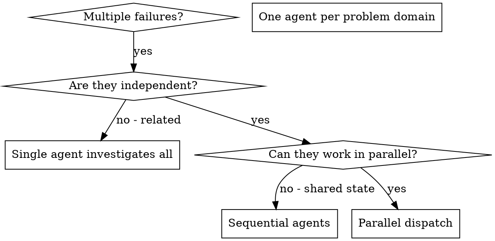

# 並列エージェントのディスパッチ

## 概要

複数の無関係な失敗（別テストファイル、別サブシステム、別バグ）がある場合、逐次で調査すると時間を無駄にする。各調査が独立しているなら並行実行できる。

**コア原則:** 独立した問題領域ごとに 1 エージェントを割り当て、同時に進める。

## 使うべきタイミング



**使う場合:**
- 根本原因が異なる 3 件以上のテストファイル失敗
- 複数サブシステムが独立して壊れている
- 各問題が他の文脈なしで理解できる
- 調査間に共有状態がない

**使わない場合:**
- 失敗が関連している（1つ直すと他も直る可能性）
- システム全体状態の理解が必要
- エージェント同士が干渉する

## パターン

### 1. 独立ドメインを特定する

壊れている対象でグルーピングする:
- File A テスト: Tool approval フロー
- File B テスト: Batch completion 挙動
- File C テスト: Abort 機能

各ドメインが独立なら、tool approval 修正が abort テストに影響しない。

### 2. フォーカスしたエージェントタスクを作る

各エージェントに渡す内容:
- **具体スコープ:** 1 テストファイルまたは 1 サブシステム
- **明確ゴール:** 対象テストを通す
- **制約:** 他コードは変更しない
- **期待出力:** 調査結果と修正内容の要約

### 3. 並列でディスパッチする

```typescript
// Claude Code / AI 環境内
Task("Fix agent-tool-abort.test.ts failures")
Task("Fix batch-completion-behavior.test.ts failures")
Task("Fix tool-approval-race-conditions.test.ts failures")
// 3つ同時に実行
```

### 4. レビューして統合する

エージェントの返却後:
- 各サマリを読む
- 修正の競合がないか確認
- 全テストスイートを実行
- すべての変更を統合

## エージェントプロンプト構造

良いプロンプトの条件:
1. **フォーカスされている** - 問題領域が 1 つ
2. **自己完結** - 問題理解に必要な文脈が揃っている
3. **出力が具体的** - 何を返すか明確

```markdown
Fix the 3 failing tests in src/agents/agent-tool-abort.test.ts:

1. "should abort tool with partial output capture" - expects 'interrupted at' in message
2. "should handle mixed completed and aborted tools" - fast tool aborted instead of completed
3. "should properly track pendingToolCount" - expects 3 results but gets 0

These are timing/race condition issues. Your task:

1. Read the test file and understand what each test verifies
2. Identify root cause - timing issues or actual bugs?
3. Fix by:
   - Replacing arbitrary timeouts with event-based waiting
   - Fixing bugs in abort implementation if found
   - Adjusting test expectations if testing changed behavior

Do NOT just increase timeouts - find the real issue.

Return: Summary of what you found and what you fixed.
```

## よくあるミス

**❌ 広すぎる:** 「全部のテストを直して」- 焦点を失う
**✅ 具体的:** 「agent-tool-abort.test.ts を直して」- スコープが明確

**❌ 文脈なし:** 「race condition を直して」- 場所が不明
**✅ 文脈あり:** エラーメッセージとテスト名を貼る

**❌ 制約なし:** 全体リファクタされる恐れ
**✅ 制約あり:** 「本番コードは変更しない」または「テストのみ修正」

**❌ 出力が曖昧:** 「直しておいて」- 変更内容が追えない
**✅ 出力が具体的:** 「根本原因と変更点の要約を返す」

## 使わないべき場合

**関連失敗:** 1つ直すと他も直る可能性があり、先にまとめて調査すべき
**全体文脈が必要:** システム全体を見ないと理解できない
**探索的デバッグ:** 何が壊れているかまだ不明
**共有状態あり:** 同じファイルや同じリソースを触って干渉する

## セッションでの実例

**シナリオ:** 大規模リファクタ後、3 ファイルに 6 件のテスト失敗

**失敗内容:**
- agent-tool-abort.test.ts: 3 件（タイミング問題）
- batch-completion-behavior.test.ts: 2 件（ツール未実行）
- tool-approval-race-conditions.test.ts: 1 件（execution count = 0）

**判断:** 独立ドメイン。abort ロジック / batch completion / race conditions は分離されている

**ディスパッチ:**
```
Agent 1 → Fix agent-tool-abort.test.ts
Agent 2 → Fix batch-completion-behavior.test.ts
Agent 3 → Fix tool-approval-race-conditions.test.ts
```

**結果:**
- Agent 1: timeout を event-based waiting に置換
- Agent 2: イベント構造バグ修正（threadId の配置誤り）
- Agent 3: 非同期ツール実行完了待ちを追加

**統合:** 修正は互いに独立、競合なし、全スイート green

**短縮効果:** 逐次でなく並列で 3 問題を解決

## 主な利点

1. **並列化** - 複数調査を同時実行
2. **集中** - 各エージェントのスコープが狭く追跡しやすい
3. **独立性** - エージェント同士が干渉しない
4. **速度** - 1 件分の時間で 3 件を処理

## 検証

エージェント返却後:
1. **各サマリをレビュー** - 何が変わったか把握
2. **競合チェック** - 同一箇所を編集していないか
3. **全スイート実行** - 修正が同時に成立するか
4. **スポットチェック** - 系統的な誤りがないか

## 実務での効果

デバッグセッション（2025-10-03）の例:
- 3 ファイルで 6 件失敗
- 3 エージェントを並列ディスパッチ
- 全調査が同時完了
- 修正を問題なく統合
- エージェント間の競合 0
