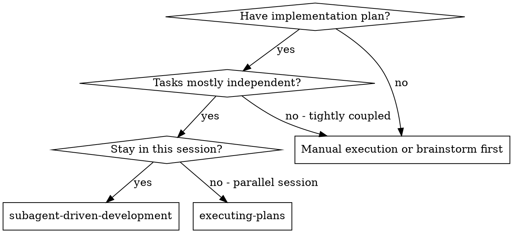
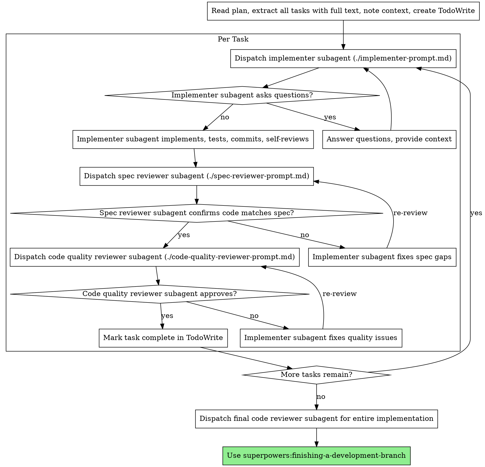

# Subagent-Driven Development

計画を実行する際、タスクごとに新しいサブエージェントをディスパッチし、各タスク後に 2 段階レビューを行う。順序は spec 準拠レビューが先、その後にコード品質レビュー。

**コア原則:** タスクごとに fresh subagent + 2 段階レビュー（spec → quality）= 高品質かつ高速反復

## 使うべきタイミング



**vs. Executing Plans（別セッション）:**
- 同一セッションで進める（コンテキスト切替なし）
- タスクごとに fresh subagent（文脈汚染を防止）
- 各タスク後に 2 段階レビュー: spec 準拠 → code quality
- 反復が速い（タスク間の human-in-loop 待ちが不要）

## プロセス



## プロンプトテンプレート

- `./implementer-prompt.md` - 実装担当サブエージェントをディスパッチ
- `./spec-reviewer-prompt.md` - spec 準拠レビュアーサブエージェントをディスパッチ
- `./code-quality-reviewer-prompt.md` - コード品質レビュアーサブエージェントをディスパッチ

## 実行例ワークフロー

```
You: I'm using Subagent-Driven Development to execute this plan.

[Read plan file once: docs/plans/feature-plan.md]
[Extract all 5 tasks with full text and context]
[Create TodoWrite with all tasks]

Task 1: Hook installation script

[Get Task 1 text and context (already extracted)]
[Dispatch implementation subagent with full task text + context]

Implementer: "Before I begin - should the hook be installed at user or system level?"

You: "User level (~/.config/superpowers/hooks/)"

Implementer: "Got it. Implementing now..."
[Later] Implementer:
  - Implemented install-hook command
  - Added tests, 5/5 passing
  - Self-review: Found I missed --force flag, added it
  - Committed

[Dispatch spec compliance reviewer]
Spec reviewer: ✅ Spec compliant - all requirements met, nothing extra

[Get git SHAs, dispatch code quality reviewer]
Code reviewer: Strengths: Good test coverage, clean. Issues: None. Approved.

[Mark Task 1 complete]

Task 2: Recovery modes

[Get Task 2 text and context (already extracted)]
[Dispatch implementation subagent with full task text + context]

Implementer: [No questions, proceeds]
Implementer:
  - Added verify/repair modes
  - 8/8 tests passing
  - Self-review: All good
  - Committed

[Dispatch spec compliance reviewer]
Spec reviewer: ❌ Issues:
  - Missing: Progress reporting (spec says "report every 100 items")
  - Extra: Added --json flag (not requested)

[Implementer fixes issues]
Implementer: Removed --json flag, added progress reporting

[Spec reviewer reviews again]
Spec reviewer: ✅ Spec compliant now

[Dispatch code quality reviewer]
Code reviewer: Strengths: Solid. Issues (Important): Magic number (100)

[Implementer fixes]
Implementer: Extracted PROGRESS_INTERVAL constant

[Code reviewer reviews again]
Code reviewer: ✅ Approved

[Mark Task 2 complete]

...

[After all tasks]
[Dispatch final code-reviewer]
Final reviewer: All requirements met, ready to merge

Done!
```

## 利点

**vs. 手動実行:**
- サブエージェントが自然に TDD を実施
- タスクごとに fresh context（混乱を防ぐ）
- 並列安全（サブエージェント同士が干渉しない）
- サブエージェントが質問できる（開始前だけでなく実行中も）

**vs. Executing Plans:**
- 同一セッション（引き継ぎ不要）
- 連続して進捗（待ち時間が少ない）
- レビューチェックポイントが自動化

**効率面の利得:**
- ファイル読み込みのオーバーヘッドなし（コントローラが全文提供）
- 必要文脈のみをコントローラがキュレート
- サブエージェントが最初から完全情報を持てる
- 作業開始前に質問が表面化（開始後ではなく）

**品質ゲート:**
- ハンドオフ前の自己レビューで問題を先取り
- 2 段階レビュー: spec 準拠 → code quality
- レビューループで修正の有効性を保証
- spec 準拠で過不足実装を防止
- code quality で実装品質を担保

**コスト:**
- サブエージェント呼び出し回数が増える（実装 + 2 レビュー / task）
- コントローラの事前準備が増える（全タスク抽出）
- レビューループ分の反復が増える
- ただし問題を早期検出でき、後工程デバッグより安い

## レッドフラグ

**Never:**
- ユーザー明示同意なしに main/master で実装開始
- レビューを省略（spec 準拠または code quality）
- 未解決課題を残したまま進行
- 複数実装サブエージェントを並列実行（競合）
- サブエージェントに plan ファイルを読ませる（全文を渡す）
- シーン説明の文脈を省略（タスク位置づけが必要）
- サブエージェントの質問を無視
- spec 準拠の「ほぼOK」を受け入れる（指摘あり = 未完）
- レビューループを省略（指摘あり = 実装修正 + 再レビュー）
- 実装者の自己レビューで正式レビューを代替する
- **spec 準拠が ✅ 前に code quality review を始める**（順序違反）
- どちらかのレビューに未解決事項があるのに次 task へ進む

**If subagent asks questions:**
- 明確かつ十分に回答
- 必要なら追加文脈を提供
- 急かして実装に入らせない

**If reviewer finds issues:**
- 同じ implementer subagent が修正
- reviewer が再レビュー
- 承認まで反復
- 再レビューを飛ばさない

**If subagent fails task:**
- 修正専用サブエージェントを具体指示で再投入
- 手動で直し始めない（文脈汚染）

## 連携

**Required workflow skills:**
- **superpowers:using-git-worktrees** - REQUIRED: 開始前に隔離 workspace を準備
- **superpowers:writing-plans** - 本スキルが実行する plan を作成
- **superpowers:requesting-code-review** - reviewer subagent 用のレビュー雛形
- **superpowers:finishing-a-development-branch** - 全タスク完了後の開発完了処理

**Subagents should use:**
- **superpowers:test-driven-development** - 各タスクで TDD を実施

**Alternative workflow:**
- **superpowers:executing-plans** - 同一セッションではなく別セッション実行時に使用
