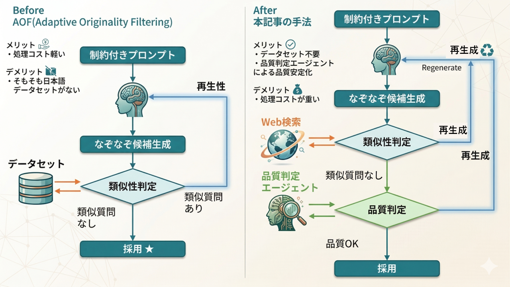

# なぜLLMはなぞなぞが下手なのか — AOFの判定器を日本語向けに作り直した理由

LLMはなぞなぞ生成の品質が不安定になりがちです。先行研究でも、なぞなぞは常識推論・比喩理解・反実仮想推論を同時に要求する高難度タスクだと報告されています。さらに自由生成は評価自体が難しく、品質を自動で判定しにくいです。  
本記事では、この難しさを前提にAOF（Adaptive Originality Filtering）の枠組みと、本プロジェクトで行った判定器の再設計を説明します。

## TL;DR

AOFの「生成→判定→再生成」を土台に、静的データセット依存の判定器をWeb検索ベースに置き換えました。

- 重複判定: 埋め込み類似度ではなくWeb検索
- 品質判定: 採点ツール（score_riddle）の中でLLMが自律採点し、`strict_score` と必須項目で合否判定

## 目次

- [ChatGPT5.4-Thinkingにそのまま作らせてみる](#chatgpt54-thinkingにそのまま作らせてみる)
- [判定ループありだとこうなる](#判定ループありだとこうなる)
- [なぜAIになぞなぞを作らせるのは難しいのか](#なぜaiになぞなぞを作らせるのは難しいのか先行研究)
- [AOFの手法を30秒で説明する](#aofの手法を30秒で説明する)
- [判定器を作り直す際に置いた原則](#判定器を作り直す際に置いた原則)
  - [1. 生成と評価を分離する](#1-生成と評価を分離する)
  - [2. 一発生成ではなく探索として扱う](#2-一発生成ではなく探索として扱う)
  - [3. 判定を二層化する](#3-判定を二層化する)
  - [4. 新規性判定を静的コーパス依存から外す](#4-新規性判定を静的コーパス依存から外す)
- [プロンプト設計](#プロンプト設計簡潔版)
- [まとめ](#まとめ)
- [参考文献](#参考文献)

## この記事でわかること

- なぜLLMはなぞなぞ生成が苦手なのか（先行研究ベース）
- AOFの枠組みをどう日本語実運用向けに作り直したか
- 判定を二層化する設計と、静的データセットをWeb検索に差し替えた理由

## ChatGPT5.4-Thinkingにそのまま作らせてみる

まずは試しにChatGPTになぞなぞを作らせてみましょう。
プロンプトは以下です。
```text
渾身のなぞなぞを5つ、答えもセットで考えてください
```
すると以下の回答が来ました。

```text
いいね、ではちょっと本気でいく 🧩
「ただのダジャレ集」じゃなくて、ちゃんと一瞬ひっかかってからスッと落ちるやつを5本、答えつきで置いていくね。

1つ目。
**なぞなぞ**
いつも前に進めと言われるのに、押されるたびに後ろへ下がっていくものはなに？
**答え**
キーボードの「Backspaceキー」
**解説**
「前に進め」は仕事や人生の話っぽく聞こえるのに、実際は“押す”と文字が後ろに消えていくキー、というズラし。

2つ目。
**なぞなぞ**
朝は長くて、昼には短くなり、夜になると消えてしまう。
でも生き物ではなく、いつも誰かにぴったりついてくるものはなに？
**答え**
影
**解説**
王道だけど、昼に短くなるという性質を素直に使うと、ちゃんと「なるほど」が出やすい。

3つ目。
**なぞなぞ**
食べられないパンなのに、毎日みんながのぞきこんでいるパンはなに？
**答え**
フライパン…ではなく、**パソコンやスマホの「画面」**
…と思わせておいて、正解は **「看板」**
**解説**
「パン」で食べ物に寄せてから、最後に「看板」の“ばん”で落とす軽い言葉遊び。
これは少し意地悪寄り。

4つ目。
**なぞなぞ**
開けても入れず、閉めても出られず、でも毎日何度も使われている“口”ってなに？
**答え**
出口・入口
**解説**
「口」で人間の口を想像させておいて、建物の“口”に着地するタイプ。言葉の意味をずらす系。

5つ目。
**なぞなぞ**
切れば切るほど、むしろ増えていくものはなに？
**答え**
トランプを切ったときの「勝負の回数」
**解説**
「紙」「髪」「穴」あたりを想像させて、カードの“切る”に逃がすやつ。ちょっと会話向きの変化球。

おまけで、いちばん筋がいいやつをもう1本置くね 🎭

（割愛！）
```

**なんじゃこりゃああ!!!!お前はGPT3.5か！！！！**
「Backspaceキー」!?
「フライパン…ではなく、**パソコンやスマホの「画面」**…と思わせておいて、正解は **「看板」**」!?!?
「影」はまだよさげですが、どっかで見たような、、、

懐かしきあのGPT-3.5時代を味わいたい方はぜひ。
プロンプト1発だと、モデルを問わず大体こんな感じです。（なんだが、Claudeだとちょっとましです。）

ツッコミだすとキリがないので、次行きます。

## 判定ループありだとこうなる

同じ「春」テーマで、判定ループを通した結果がこちらです。

| 問題文 | 答え |
|--------|------|
| 空から落ちるのに、すすれるものは？ | 春雨 |
| 歓声と一緒に飲むのは？ | エール |
| 寒い日ほど、隠れていられなくなるものは何？ | 息 |

おおお！ちょっと良い感じやん。
ちなみにこれでも2,3回は試行錯誤する必要あります。なぞなぞ生成は謎に難しい。

なぜこうなるのか、次から説明します。

## なぜAIになぞなぞを作らせるのは難しいのか（先行研究）

難しさは「生成」だけではなく「推論」と「評価」にまたがっています。

1. **必要な認知負荷が高い**  
`RiddleSense` は、なぞなぞ回答に「常識推論」「比喩理解」「反実仮想推論」が同時に必要だと指摘しています。さらに、モデルと人間の間に大きな性能差が残ることも報告されています。  
https://arxiv.org/abs/2101.00376

2. **“常識通りに考えるほど外す”問題がある**  
`BRAINTEASER` は、なぞなぞ型問題を「デフォルトの常識連想を外せるか」を測るタスクとして設計しています。論文では、人間とモデルのギャップが大きく、言い換え版で一貫性まで問うと差がさらに広がると報告されています。  
https://aclanthology.org/2023.emnlp-main.885/

3. **自由生成の評価自体が難しい**  
SemEval-2024 Task 9 の概要論文では、元のなぞなぞがオープンエンドで「評価が非常に難しい」ため、多肢選択形式へ変換して評価可能にしたと説明されています。  
https://aclanthology.org/2024.semeval-1.274.pdf

4. **プロンプト1発だと出力が浅くなりやすい**  
`AOF` は、多言語の創造的ななぞなぞ生成で、標準的なプロンプトは反復的・表層的になりやすいと述べ、リジェクションを含む枠組みを提案しています。  
https://arxiv.org/abs/2508.18709

この4点をまとめると、なぞなぞ生成は「うまい文を出す問題」ではなく、**推論の質・新規性・採点可能性を同時に満たす問題**です。

## AOFの手法を30秒で説明する

AOFの核は、**生成→判定→再生成**の反復です。  
主要な処理は以下の３ステップです。

1. プロンプト制約つきで問題を生成する  
2. 既存問題との近さを測って、閾値で通過/棄却を判定する  
3. 棄却なら再生成し、通過するまで繰り返す

図にすると、次の流れです。



本プロジェクトはこの枠組みを踏襲しつつ、判定器を実運用向け（検索ベース）に置き換えています。

## 判定器を作り直す際に置いた原則

AOFの骨格は維持した上で、判定器を再設計するにあたって4つの原則を置きました。

### 1. 生成と評価を分離する

生成モデルに「作る」と「採点する」を同時に持たせると自己評価が甘くなりやすいです。  
そのため、生成ループと評価ループを役割として分離し、採点器をMCPツールとして外出ししています。

### 2. 一発生成ではなく探索として扱う

良問を1回で当てにいくのではなく、候補を回しながら選抜します。  
品質は「偶然」ではなく「探索の設計」で安定化できます。

### 3. 判定を二層化する

合否判定（ハードゲート）と品質評価（スコア）を混在させません。  
最低ラインを満たすかどうかと、どれだけ良いかは別軸で扱います。  
たとえば一意性は合否条件には入れず、`strict_score` への減点として反映しています。

### 4. 新規性判定を静的コーパス依存から外す

静的データセットだけでは更新遅延とカバレッジ不足が避けにくいです。  
特に日本語では、AOFが参照する `BiRdQA`（英中バイリンガルなぞなぞデータセット）のような公開データが少なく、影響が大きいです。  
そのため、実際に流通している情報をWeb検索で参照しながら判定する構成を採用しています。

## プロンプト設計（簡潔版）

生成側（リーダー + 生成スキル）の要点:

```text
- 1回で1問だけ生成
- 生成時に指定するパターンで粘る（以下は使用パターンの一部）
  - `paradox`（逆説）: 常識と逆の問いかけで答えを誘導する
  - `pun`（語呂合わせ）: 音の類似・同音異義を利用する
  - `char_extract`（文字抽出）: 文や単語から特定の文字を取り出す
  - `reverse_read`（逆読み）: 逆から読むと別の言葉になる構造を使う
  - `kanji_structure`（漢字構造）: 漢字の部首・形・成り立ちを使う
- 問題文は短く、答えバレ・定番答え・特徴当てクイズを避ける
- Web重複チェックと score_riddle を通し、落ちた理由を反映して再生成
```

採点側（scorer_prompt）の要点:

```text
- パターン非依存で公平採点
- ハードゲート: 一段構造 / 具体性
- 一意性はソフトファクター（strict_scoreで減点）
- 検索証拠をプロンプトに注入してオリジナリティ評価
- 最終判定: structural_soundness && concrete_grounding && strict_score >= threshold
```

## まとめ

なぞなぞ生成の品質は、プロンプトの巧さより判定ループの設計で決まります。

本プロジェクトでやったことはシンプルです。AOFの骨格（生成→判定→再生成）はそのまま採用し、判定器だけを日本語実運用向けに作り直しました。静的データセット中心の評価器を、Web検索と品質ゲートを併用する評価器に差し替えた、それだけです。

日本語なぞなぞのように曖昧性が高い＆そもそもデータセットがない領域では、特にこの設計が効きます。

実装の詳細（コード・設定・テスト）はリポジトリを参照してください。

https://github.com/nahrun1682/AIRiddleMaker

## 参考文献

- **RiddleSense**: He et al. (2021) "RiddleSense: Reasoning about Riddle Questions Featuring Linguistic Creativity and Commonsense Knowledge" https://arxiv.org/abs/2101.00376
- **BRAINTEASER**: Jiang et al. (2023) "BRAINTEASER: Lateral Thinking Puzzles for Large Language Models" https://aclanthology.org/2023.emnlp-main.885/
- **SemEval-2024 Task 9**: Bhagavatula et al. (2024) "SemEval-2024 Task 9: BRAINTEASER: A Novel Task Defying Common Sense" https://aclanthology.org/2024.semeval-1.274.pdf
- **AOF**: "Adaptive Originality Filtering for Creative Riddle Generation" https://arxiv.org/abs/2508.18709
